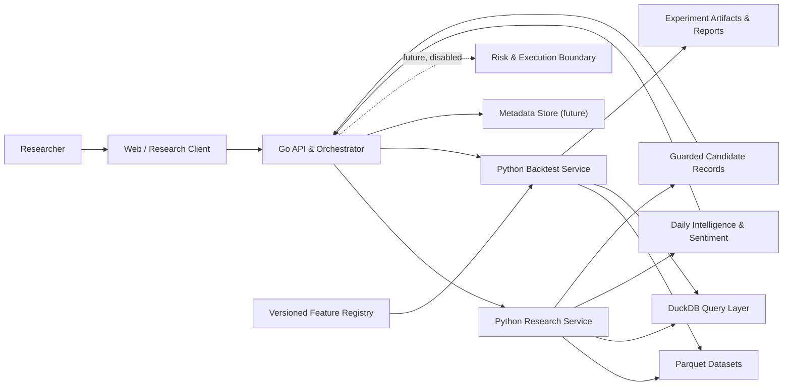
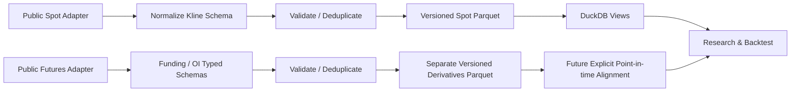
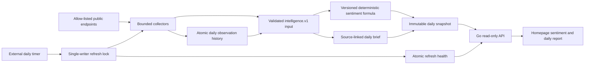
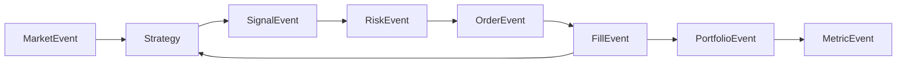
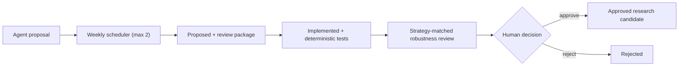
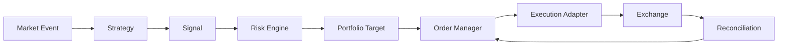

# Architecture

## Architectural style

QuantOS starts as a modular monolith. Modules have explicit contracts and may
run as separate processes where language or workload boundaries require it, but
they remain one product, one repository, and one coordinated deployment model.
This avoids distributed-system overhead before domain boundaries are proven.

## Go and Python boundary

Go owns the platform control plane:

- REST/WebSocket APIs and user-facing platform services
- project and task orchestration
- future order management, risk enforcement, and exchange connectivity
- real-time state and operational health

Python owns the research compute plane:

- historical market-data ingestion and validation
- feature and factor computation
- strategy development
- event-driven backtesting
- metrics, experiment execution, and AI research tools

The boundary uses versioned event and request/response schemas from `packages/`.
Neither language reads another module's internal persistence representation as
an integration API.

## Module boundaries

- `apps/`: deployable entry points and composition roots.
- `services/market-data`: exchange-neutral ingestion and dataset lifecycle.
- `services/research`: hypotheses, features, and research workflows.
- `services/backtest`: deterministic event-driven simulation.
- `services/risk`: policy evaluation independent of strategy logic.
- `services/execution`: future order lifecycle; inert in current milestones.
- `services/agent`: tool-gated AI research workflows.
- `packages/`: stable shared schemas, SDKs, metrics, and common utilities.

## System view

## Market-data flow

Adapters cannot leak exchange-specific response models past normalization.
Dataset manifests will include source, symbols, intervals, time range, schema
version, row counts, checksums, and creation metadata.

Funding and open-interest observations are never implicitly joined to Spot
Klines. Each has its own immutable dataset identity and source limitation. A
future feature must bind exact dataset versions and prove that every selected
derivatives observation was available at or before the closed decision bar. See
[ADR-0023](docs/adr/0023-version-public-derivatives-market-data.md).

## Daily intelligence flow

The Agent may collect, deduplicate, classify, and summarize untrusted external
content. It cannot choose index weights, modify scores after calculation,
execute host commands, access trading credentials, or trigger trading. Every
snapshot records factor observations, methodology version, source links,
timestamps, and input identity. See
[ADR-0012](docs/adr/0012-deterministic-daily-market-intelligence.md) and
[ADR-0020](docs/adr/0020-public-read-only-intelligence-collectors.md). Daily
operation is an explicit locked job; failures preserve the last valid snapshot
and expose bounded health without hidden API-startup collection. See
[ADR-0021](docs/adr/0021-observable-daily-intelligence-refresh.md).

## Backtest event flow

The event clock is controlled by the engine. Strategy code may only observe the
current and past state. Fills apply configured fees, slippage, and later funding
rules before portfolio updates.

Each strategy owns separate implementation code and a versioned manifest
describing its category, lifecycle stage, supported intervals, and editable
parameters. The implementations share the same event clock, risk, execution,
portfolio, metrics, and artifact pipeline. Research candidates require
reproducible evidence and explicit human promotion before their lifecycle state
can advance.

Candidate evidence passes through four deterministic robustness gates before a
promotion proposal: walk-forward consistency, neighboring-parameter
sensitivity, doubled-cost retention, and aligned multi-market results. Each
gate links ordinary immutable Run IDs; passing never changes lifecycle state by
itself. See [ADR-0017](docs/adr/0017-deterministic-robustness-gates.md).

Before artifact publication, built-in strategy parameters resolve through the
feature registry into concrete EMA, prior-bar channel, and ATR instances. Their
definition hashes, exact inputs, causality policy, warmup, and parameter
bindings participate in new Run identities. See
[ADR-0022](docs/adr/0022-version-strategy-feature-lineage.md).

Candidate state advances through a separate guarded flow:

Proposal identity is content-addressed. Only the Python lifecycle command may
append transitions; the Go API and web workspace are read-only consumers.
Approval does not register executable strategy code and cannot enable trading.
See [ADR-0018](docs/adr/0018-guarded-candidate-lifecycle.md) and
[ADR-0019](docs/adr/0019-rate-limited-candidate-draft-scheduling.md).

V0.1 strategies observe a bar at its close and approved targets execute at the
next bar open. See [ADR-0004](docs/adr/0004-next-bar-open-execution.md).

## Future live flow

Live trading is not implemented. If introduced after paper-trading validation,
it must preserve the same signal and risk contracts:

Enabling this path will require a dedicated ADR, secret management, idempotent
client order IDs, reconciliation, pause policies, and a human-controlled kill
switch.

## Persistence direction

- Parquet: immutable historical market data and feature datasets.
- DuckDB: local analytical queries over Parquet.
- PostgreSQL: future transactional metadata for projects, runs, and orders.
- Redis: future ephemeral task state, caching, and locks.
- Object storage: future reports, charts, and large experiment artifacts.

Only Parquet and DuckDB are required for the initial research loop.

## Research-service deployment

The first hosted compute boundary packages the Go control plane and canonical
Python research environment into one stateful container. It remains a modular
monolith and runs as a single replica while Tasks use the file-backed store.
Persistent storage supplies immutable datasets, Task records, experiment
artifacts, daily-intelligence snapshots, and candidate records; none of those
generated inputs are baked into the image.

The service exposes separate liveness and data-aware readiness checks. Dataset
synchronization is an explicit administrative command, not startup behavior.
The Cloudflare-hosted workspace calls this service over an explicitly
allow-listed HTTPS origin. See [ADR-0015](docs/adr/0015-deploy-canonical-research-service.md).

## Non-goals

- Microservice decomposition in Phase 0/V0.1
- High-frequency, tick, or full order-book simulation
- Multi-exchange arbitrage
- Production live execution
- Kubernetes and independently scalable infrastructure
- A multi-tenant SaaS platform

## Decision records

Normative architecture choices live in [`docs/adr`](docs/adr/README.md).
