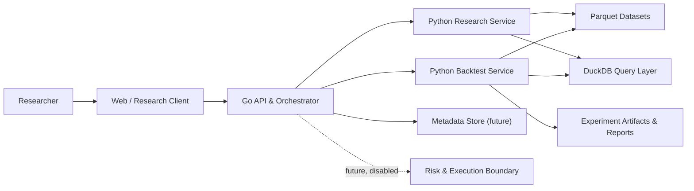
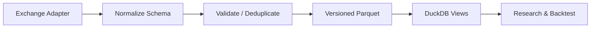
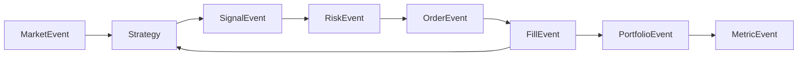
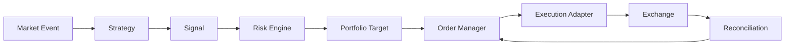

# Architecture

## Architectural style

QuantOS starts as a modular monolith. Modules have explicit contracts and may
run as separate processes where language or workload boundaries require it, but
they remain one product, one repository, and one coordinated deployment model.
This avoids distributed-system overhead before domain boundaries are proven.

## Go and Python boundary

Go owns the platform control plane:

- REST/WebSocket APIs and user-facing platform services
- project and task orchestration
- future order management, risk enforcement, and exchange connectivity
- real-time state and operational health

Python owns the research compute plane:

- historical market-data ingestion and validation
- feature and factor computation
- strategy development
- event-driven backtesting
- metrics, experiment execution, and AI research tools

The boundary uses versioned event and request/response schemas from `packages/`.
Neither language reads another module's internal persistence representation as
an integration API.

## Module boundaries

- `apps/`: deployable entry points and composition roots.
- `services/market-data`: exchange-neutral ingestion and dataset lifecycle.
- `services/research`: hypotheses, features, and research workflows.
- `services/backtest`: deterministic event-driven simulation.
- `services/risk`: policy evaluation independent of strategy logic.
- `services/execution`: future order lifecycle; inert in current milestones.
- `services/agent`: tool-gated AI research workflows.
- `packages/`: stable shared schemas, SDKs, metrics, and common utilities.

## System view

## Market-data flow

Adapters cannot leak exchange-specific response models past normalization.
Dataset manifests will include source, symbols, intervals, time range, schema
version, row counts, checksums, and creation metadata.

## Backtest event flow

The event clock is controlled by the engine. Strategy code may only observe the
current and past state. Fills apply configured fees, slippage, and later funding
rules before portfolio updates.

## Future live flow

Live trading is not implemented. If introduced after paper-trading validation,
it must preserve the same signal and risk contracts:

Enabling this path will require a dedicated ADR, secret management, idempotent
client order IDs, reconciliation, pause policies, and a human-controlled kill
switch.

## Persistence direction

- Parquet: immutable historical market data and feature datasets.
- DuckDB: local analytical queries over Parquet.
- PostgreSQL: future transactional metadata for projects, runs, and orders.
- Redis: future ephemeral task state, caching, and locks.
- Object storage: future reports, charts, and large experiment artifacts.

Only Parquet and DuckDB are required for the initial research loop.

## Non-goals

- Microservice decomposition in Phase 0/V0.1
- High-frequency, tick, or full order-book simulation
- Multi-exchange arbitrage
- Production live execution
- Kubernetes and independently scalable infrastructure
- A multi-tenant SaaS platform

## Decision records

Normative architecture choices live in [`docs/adr`](docs/adr/README.md).
