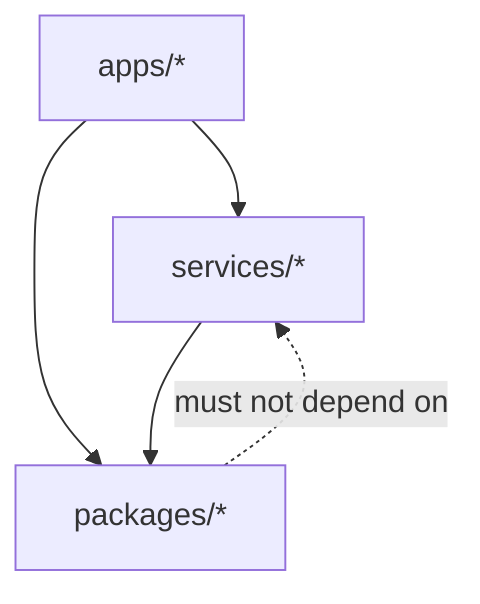

# Module Boundaries

## Dependency direction

Product entry points compose domain modules. Domain modules depend on stable
contracts in `packages/`, not on another module's internal code or storage.

## Ownership rules

| Module | Owns | Must not own |
| --- | --- | --- |
| market-data | ingestion, normalization, validation, dataset manifests | strategy decisions |
| research | hypotheses, features, exploratory workflows | exchange execution |
| backtest | event clock, simulation, fills, portfolio accounting | live credentials |
| risk | policy evaluation and limits | alpha generation |
| execution | future order state and adapters | strategy logic |
| agent | tool orchestration and evidence links | bypass authority |

The `execution` module is a documented boundary only during V0.1. It contains no
live adapter or credential handling.
